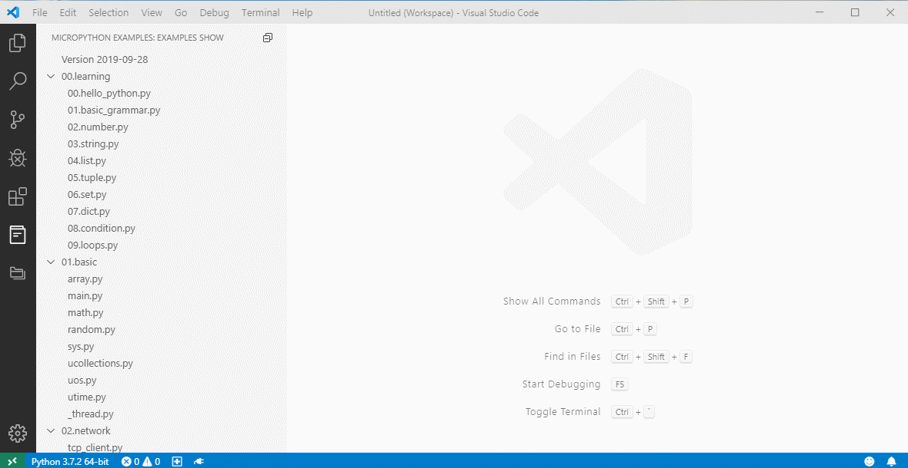
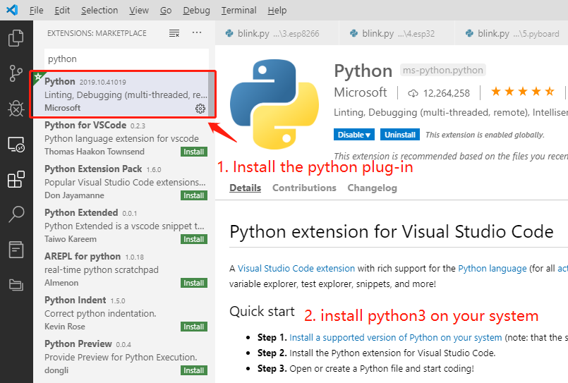
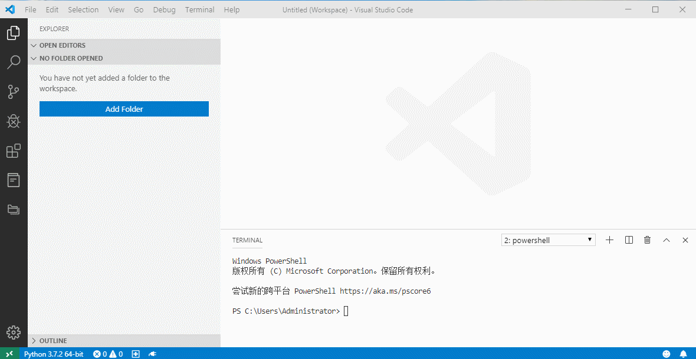
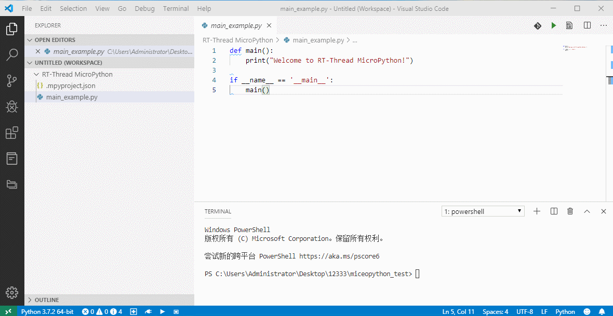
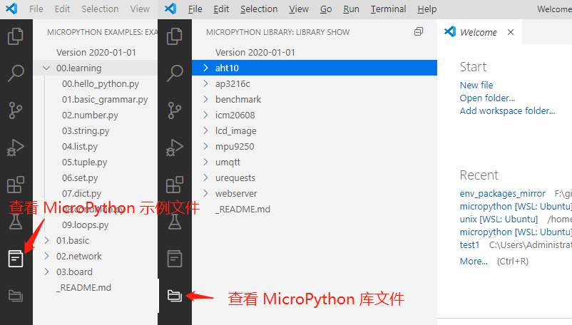
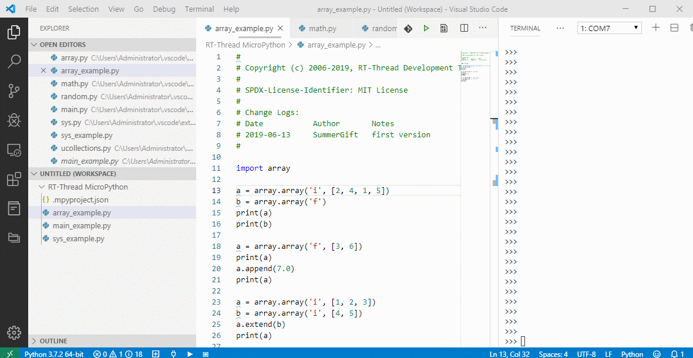
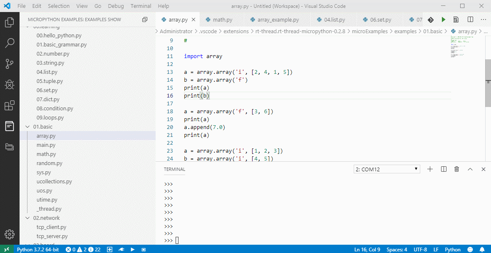
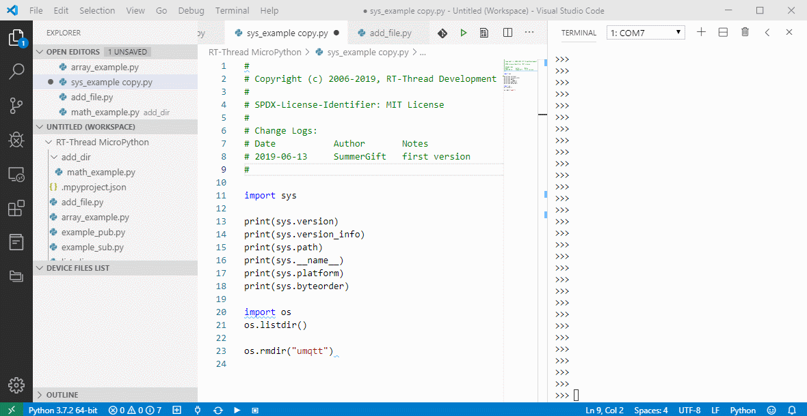
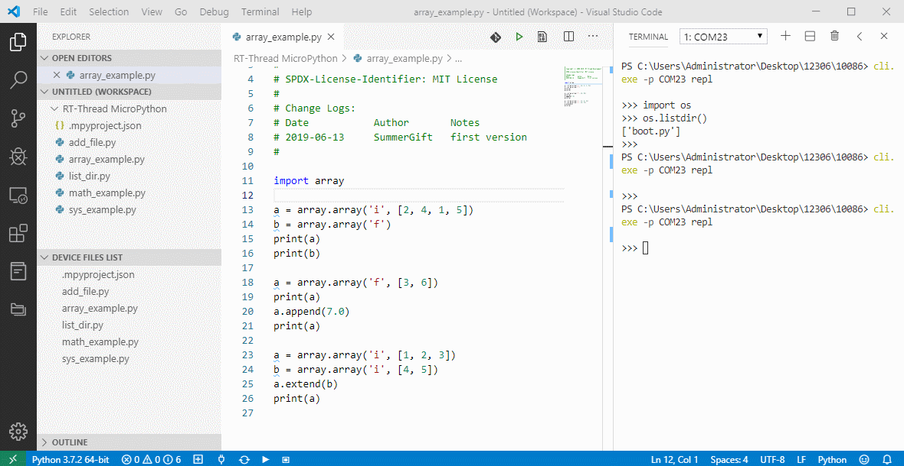

# Best MicroPython Development Tools

## Introduction

RT-Thread MicroPython is the best micropython plug-in in VScode, which provides a powerful development environment for MicroPython development. The main features are as follows:

- Convenient connection mode of development board (serial port, network, USB)
- Support MicroPython-based code intelligent completion and syntax check
- Support MicroPython REPL interactive environment
- Provides many code samples and demo program
- Support full project synchronization function
- Support to download files or folders to the development board
- Supports fast running code files in memory
- Supports code snippets to run functions
- Supports several major MicroPython development boards
- Support Windows and ubuntu operating systems

## Development board support list

| number | Name of development board                                    | Firmware acquisition                                         |
| ------ | ------------------------------------------------------------ | ------------------------------------------------------------ |
| 1      | [潘多拉 IoT Board 物联网开发板 STM32L475](https://item.taobao.com/item.htm?spm=a1z10.5-c-s.w4002-18400369818.12.2ba47ea5PzJxZx&id=583843059625) | [RT-Thread 论坛固件汇总贴](https://www.rt-thread.org/qa/forum.php?mod=viewthread&tid=12305&page=1&extra=#pid52954) |
| 2      | [正点原子 W601 WIFI 物联网开发板](https://item.taobao.com/item.htm?spm=a230r.1.14.13.7c5b4a9bS2LYUD&id=602233847745&ns=1&abbucket=17#detail) | [RT-Thread 论坛固件汇总贴](https://www.rt-thread.org/qa/forum.php?mod=viewthread&tid=12305&page=1&extra=#pid52954) |
| 3      | [正点原子探索者 STM32F407 开发板](https://item.taobao.com/item.htm?spm=a1z10.5-c-s.w4002-18400369818.18.569779dc0A3gkT&id=41855882779) | [RT-Thread 论坛固件汇总贴](https://www.rt-thread.org/qa/forum.php?mod=viewthread&tid=12305&page=1&extra=#pid52954) |
| 4      | [RT-Thread 麻雀一号音视频开发板](https://item.taobao.com/item.htm?spm=a1z0k.7385961.1997985097.d4918997.42d74829w5rUfo&id=606684373403&_u=t2dmg8j26111) | [RT-Thread 论坛固件汇总贴](https://www.rt-thread.org/qa/forum.php?mod=viewthread&tid=12305&page=1&extra=#pid52954) |
| 5      | [ESP8266](http://docs.micropython.org/en/latest/esp8266/quickref.html) | [Official download link](https://micropython.org/download#esp8266) |
| 6      | [ESP32](http://docs.micropython.org/en/latest/esp32/quickref.html) | [Official download link](https://micropython.org/download#esp32) |
| 7      | [PYboard](http://docs.micropython.org/en/latest/pyboard/quickref.html) | [Official download link](https://micropython.org/download#pyboard) |
| 8      | [others](https://micropython.org/download#other)             | [Official download link](https://micropython.org/download#other) |

The firmware numbered 1 - 4 are provided by rt-thread, and they are also optimized for MicroPython plug-in development environment to provide powerful project synchronization and more features. 

## Preparation

1. Using plug-in under the Windows operating system requires changing the default terminal of VScode to powershell, as shown below:

   

If you want to use the MicroPython autocompletion feature (you can skip the next step if you don't need autocompletion for now), you need to do the following:

2. Install the Python plug-in

3. Install Python3 on your PC and add it to the system environment variables as instructed by the Python plug-in

   

If you already have the above plug-ins and programs installed on your PC, you can skip this preparation step.

### Ubuntu support

This plug-in supports running under **ubuntu 18.04**. In order to avoid frequent access to serial port permissions under ubuntu system, the current user needs to be added to the user group `dialout`. Manually enter the following command: `$USERNAME` is the current USERNAME of the system:

`sudo usermod -ag dialout $USERNAME`

Note: the configuration change requires **to restart the operating system** for the configuration to take effect.

### Mac support

RT-Thread MicroPython plug-in supports Mac 10.15 Catalina OS.

## Quick Start

### Create a MicroPython project

The first step in MicroPython development is to create a MicroPython project within which all subsequent operations must run. There are two ways to create a new MicroPython project, a blank project and a demo-based project, which are shown below.

### Connecting development board

You can connect to the MicroPython development board by clicking the connection button in the lower left corner and then selecting the device you want to connect to in the pop-up list of devices.

### View the sample code file

The MicroPython plug-in provides a wealth of sample code and library files to view in the left active bar. Right-click on the sample file to add the sample file to the project from the drop-down menu.

### Run MicroPython files directly on the development board (kind for debug)

This feature is used to `quickly debug a single file` and is frequently used in debugging code. When we write the test program in a separate file, we can use this function to download the current python file to the memory of the development board to run, achieving the effect of rapid debugging. We can also use the shortcut key `Alt + q` to trigger this function.

### Run MicroPython code snippets on the development board

If you just want to debug a small amount of code without downloading files to the development board, you can use the **code snippet** function. You can run the selected code in the REPL environment by selecting the snippet you want to run in the editor, and then selecting the `execute the selected MicroPython code` option on the device from the right-click menu.

### Download files/folders to the development board

If you want to download individual files/folders to the development board, you can use the function of to **download individual files/folders to the development board**. Select the file/folder in the project that you want to download to the development board and use this feature in the drop-down menu. 

Note that if there are files/folders with the `same name` on the development board, the download will `overwrite` the existing files/folders.

By entering the command `os.listdir()` in `repl`, you can check whether the corresponding file/folder has been `downloaded` successfully. Similarly, you can also use the corresponding command **to delete the file or folder** in `repl`. The command list is as follows:

| function       | command                       |
| ---------- | -------------------------- |
| remove file   | `os.remove("file_to_del")` |
| remove folder | `os.rmdir("folder_to_del")`   |

### Project synchronization

Click the synchronization button `in the lower left corner` to start the project synchronization function. This feature synchronizes `all directory files` in the local project to the development board's file system. This feature is recommended to be used `after the code is debugged`, without the need to synchronize the project frequently during debugging.

After the project synchronization is completed, `the list of files` in the DEVICE can be seen in the `DEVICE FILES LIST column`.

### Intelligent code completion based on MicroPython

This plug-in supports `intelligent code completion` and syntax checking `based on MicroPython syntax`, which is a powerful tool for developing MicroPython code. It allows developers to write functions while looking at API parameter hints, and it gives them a visual reminder that makes it easier to find errors in code.

## Contact & Supports

- [Github](https://github.com/SummerLife/micropython-tools)
